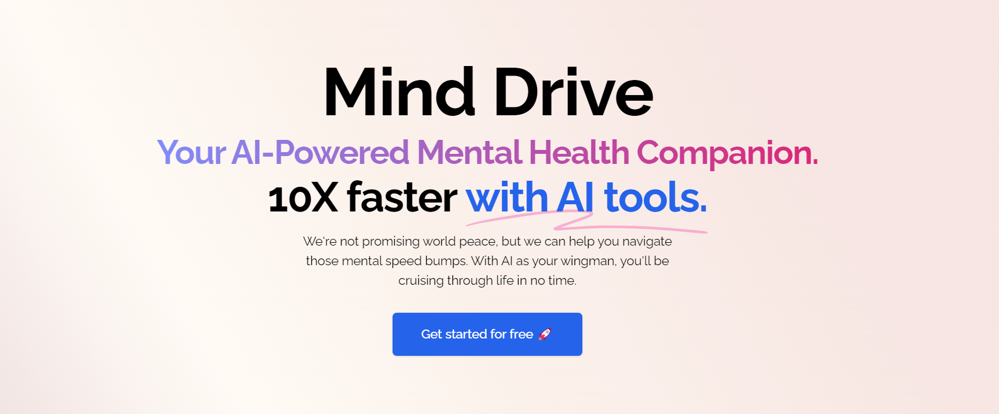

# MindDrive - AI Powered Mental Wellbeing PWA




## Table of Contents

- [Overview](#overview)
- [Tech Stack](#tech-stack)
- [Features](#features)
- [Deployment](#deployment)
- [Usage](#usage)
- [Folder Structure](#folder-structure)
- [License](#license)


## Overview
Mind Drive leverages Node.js, EJS, Tailwind CSS, and MongoDB to offer a holistic mental health platform. 

Featuring an AI-driven chatbot, it intuitively gauges user moods, community support, and a resource library for enhanced emotional well-being.

## Tech Stack

- EJS: Embedded JavaScript templates for server-side rendering.
- Node.js: JavaScript runtime environment.
- Gemini API : For AI Responses

## Features

Mind Drive integrates a sophisticated AI chatbot within its Node.js and MongoDB framework, providing users with personalized mental health support. The chatbot serves as a versatile tool, enabling users to express their feelings confidentially and receive immediate emotional guidance. 

Beyond mood assessment, users can explore tailored fun activities, curated based on their current emotional state. This feature not only enhances engagement but also promotes positive mental health practices. 

Additionally, Mind Drive offers a comprehensive resource library, fostering community engagement and providing a platform for users to share experiences and support each other in their mental health journey.

## Deployment
This project is deployed on Render for production. Render provides scalability and reliability for hosting web applications. [Deployed link](https://minddrive.onrender.com)

## Usage

- Clone the repository.
```bash
git clone https://github.com/sristy17/MindDrive.git
```

- Install the dependencies
```bash
npm install
```

- Add an `.env` file in the root directory.
```bash
DB_USER=hacktoberfest
DB_PASSWORD=hacktoberfest
DB_APPNAME=dev-db

GEMINI_API_ENDPOINT=https://generativelanguage.googleapis.com/v1beta/models/gemini-1.5-flash-latest:generateContent
GEMINI_API_KEY=<gemini-api-key>
```
#### _(Get your Gemini API key from [here](https://aistudio.google.com/app/apikey))_


- Start the application
```bash
npm run dev
```

## Folder Structure


```bash
MindDrive/
│
├── config/
│ ├──db.config.js
│ └── keys.config.js
│
├── controllers/
│ ├── auth.controller.js
│ └──  gemini.controller.js
│
├── database/
│ └── Mongo.database.js
│
├──models/
│ └── user.model.js
│
├── public/
│    ├── css/
│      ├── modal.css
│      └── style.css
│    ├── images/
│      └──  emojis/
│    └──  js/
│      ├── chatbot.js
│      └── global.js
│
├── routes/
│   ├── auth.routes.js
│   └── gemini.routes.js
│
├── viewss/
│ ├── includes/
│    ├── navbar.ejs
│    └── sidebar.ejs
│ └──pages/
│    ├──about.ejs
│    ├──chatbot.ejs
│    ├──index.ejs
│    └── profile.ejs
├── .gitignore
├── LICENSE
├── README
├── app.js
├── package-lock.json
└── package.json
```

## License

This is project is under [MIT LICENSE](LICENSE) and is submitted to _[#AIForTomorrow](https://hashnode.com/hackathons/ai-for-tomorrow?source=hackathon-feed-widget)_
